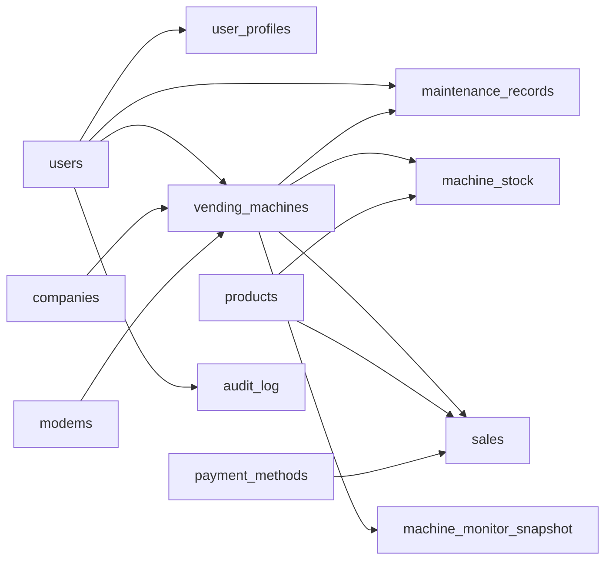

# ERD (Logical)

```mermaid
flowchart LR
    users --> user_profiles
    users --> maintenance_records
    users --> vending_machines
    companies --> vending_machines
    modems --> vending_machines
    vending_machines --> machine_stock
    products --> machine_stock
    vending_machines --> sales
    products --> sales
    payment_methods --> sales
    vending_machines --> maintenance_records
    vending_machines --> machine_monitor_snapshot
    users --> audit_log
```

Физическая схема и ограничения: `db/sql/001_schema.sql` + `db/sql/002_constraints.sql`.
