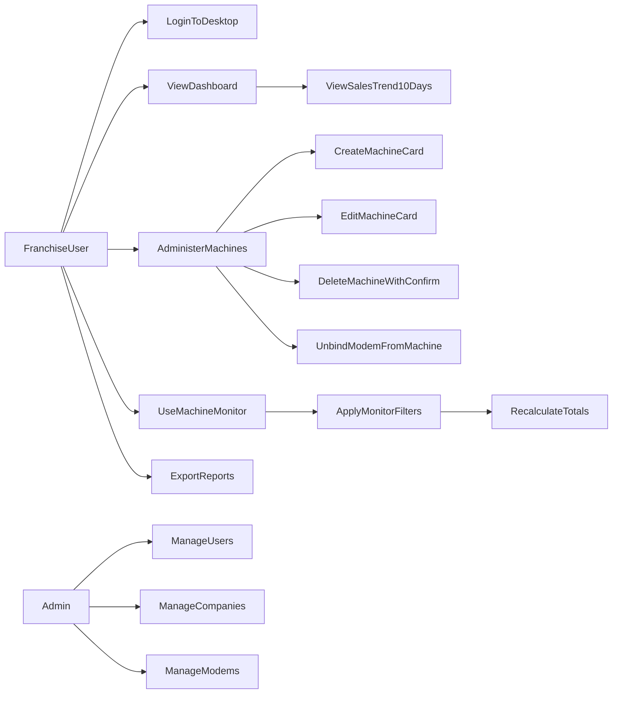

# Use Case Diagram

```mermaid
flowchart LR
    franchiseUser["FranchiseUser"] --> loginUseCase["LoginToDesktop"]
    franchiseUser --> dashboardUseCase["ViewDashboard"]
    franchiseUser --> monitorUseCase["UseMachineMonitor"]
    franchiseUser --> adminUseCase["AdministerMachines"]
    franchiseUser --> exportUseCase["ExportReports"]

    adminUser["Admin"] --> userManageUseCase["ManageUsers"]
    adminUser --> companyManageUseCase["ManageCompanies"]
    adminUser --> modemManageUseCase["ManageModems"]

    dashboardUseCase --> salesTrendUseCase["ViewSalesTrend10Days"]
    adminUseCase --> machineCreateUseCase["CreateMachineCard"]
    adminUseCase --> machineEditUseCase["EditMachineCard"]
    adminUseCase --> machineDeleteUseCase["DeleteMachineWithConfirm"]
    adminUseCase --> modemUnbindUseCase["UnbindModemFromMachine"]
    monitorUseCase --> filterUseCase["ApplyMonitorFilters"]
    filterUseCase --> totalsUseCase["RecalculateTotals"]
```
